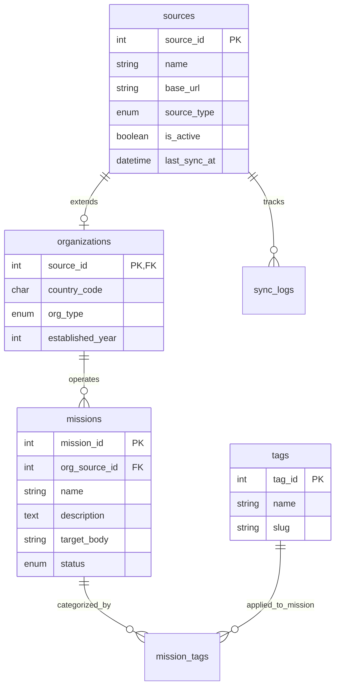

# Database Schema

## Overview

This database architecture is designed for a space exploration information portal. It uses the Class Table Inheritance pattern to separate organizations from the shared sources table, and stores space missions, taxonomy tags, and crawler synchronization history.

## Entities Summary

- sources: Base table for all data sources containing shared network and status metadata.
- organizations: Sub-type table extending sources with organization-specific attributes.
- missions: Tracks specific space missions and connects them to responsible organizations.
- tags: Taxonomy for filtering missions.
- mission_tags: Junction table connecting missions to tags.
- sync_logs: Execution logs for API crawlers to monitor system health and rate limits.

---

## Entity-Relationship Diagram (UML / Mermaid)



## DDL (MySQL 8.0 Compatible)

```sql
CREATE DATABASE IF NOT EXISTS space_exploration_db
  DEFAULT CHARACTER SET utf8mb4
  DEFAULT COLLATE utf8mb4_0900_ai_ci;

USE space_exploration_db;

-- 1. Base Data Sources Table
CREATE TABLE sources (
    source_id INT UNSIGNED AUTO_INCREMENT PRIMARY KEY,
    name VARCHAR(100) NOT NULL,
    base_url VARCHAR(255) NOT NULL,
    api_endpoint VARCHAR(255) DEFAULT NULL,
    source_type ENUM('organization', 'blog', 'other') NOT NULL,
    is_active BOOLEAN NOT NULL DEFAULT TRUE,
    last_sync_at DATETIME DEFAULT NULL COMMENT 'Timestamp of last successful API sync',
    created_at DATETIME NOT NULL DEFAULT CURRENT_TIMESTAMP,
    updated_at DATETIME NOT NULL DEFAULT CURRENT_TIMESTAMP ON UPDATE CURRENT_TIMESTAMP,
    INDEX idx_source_type (source_type)
) ENGINE=InnoDB DEFAULT CHARSET=utf8mb4 COLLATE=utf8mb4_0900_ai_ci;

-- 2. Organizations Sub-type Table (Renamed from space_agencies)
CREATE TABLE organizations (
    source_id INT UNSIGNED PRIMARY KEY,
    country_code CHAR(3) DEFAULT NULL COMMENT 'ISO-3166 3-letter country code (e.g., USA, JPN)',
    org_type ENUM('government_agency', 'commercial_company', 'research_institute', 'non_profit', 'international_body') NOT NULL DEFAULT 'government_agency',
    established_year INT DEFAULT NULL,
    CONSTRAINT fk_organizations_source FOREIGN KEY (source_id) REFERENCES sources (source_id) ON DELETE CASCADE
) ENGINE=InnoDB DEFAULT CHARSET=utf8mb4 COLLATE=utf8mb4_0900_ai_ci;

-- 3. Space Missions Table
CREATE TABLE missions (
    mission_id INT UNSIGNED AUTO_INCREMENT PRIMARY KEY,
    org_source_id INT UNSIGNED DEFAULT NULL COMMENT 'Optional link to responsible organization',
    name VARCHAR(100) NOT NULL,
    description TEXT NOT NULL,
    target_body VARCHAR(50) DEFAULT NULL COMMENT 'Target astronomical object (e.g., Mars, Moon)',
    status ENUM('planned', 'active', 'completed', 'failed') NOT NULL DEFAULT 'planned',
    launched_at DATETIME DEFAULT NULL,
    created_at DATETIME NOT NULL DEFAULT CURRENT_TIMESTAMP,
    updated_at DATETIME NOT NULL DEFAULT CURRENT_TIMESTAMP ON UPDATE CURRENT_TIMESTAMP,
    CONSTRAINT fk_missions_org FOREIGN KEY (org_source_id) REFERENCES organizations (source_id) ON DELETE SET NULL,
    UNIQUE KEY uq_mission_name (name)
) ENGINE=InnoDB DEFAULT CHARSET=utf8mb4 COLLATE=utf8mb4_0900_ai_ci;

-- 4. Filtering Tags Table
CREATE TABLE tags (
    tag_id INT UNSIGNED AUTO_INCREMENT PRIMARY KEY,
    name VARCHAR(50) NOT NULL,
    slug VARCHAR(50) NOT NULL,
    created_at DATETIME NOT NULL DEFAULT CURRENT_TIMESTAMP,
    UNIQUE KEY uq_tag_name (name),
    UNIQUE KEY uq_tag_slug (slug)
) ENGINE=InnoDB DEFAULT CHARSET=utf8mb4 COLLATE=utf8mb4_0900_ai_ci;

-- 5. Mission Taxonomy Tags Junction Table
CREATE TABLE mission_tags (
    mission_id INT UNSIGNED NOT NULL,
    tag_id INT UNSIGNED NOT NULL,
    PRIMARY KEY (mission_id, tag_id),
    CONSTRAINT fk_mt_mission FOREIGN KEY (mission_id) REFERENCES missions (mission_id) ON DELETE CASCADE,
    CONSTRAINT fk_mt_tag FOREIGN KEY (tag_id) REFERENCES tags (tag_id) ON DELETE CASCADE
) ENGINE=InnoDB DEFAULT CHARSET=utf8mb4 COLLATE=utf8mb4_0900_ai_ci;

-- 6. Crawler Sync Execution Logs
CREATE TABLE sync_logs (
    log_id BIGINT UNSIGNED AUTO_INCREMENT PRIMARY KEY,
    source_id INT UNSIGNED NOT NULL,
    status ENUM('success', 'partial_success', 'failed') NOT NULL,
    fetched_count INT UNSIGNED NOT NULL DEFAULT 0,
    error_message TEXT DEFAULT NULL,
    executed_at DATETIME NOT NULL DEFAULT CURRENT_TIMESTAMP,
    CONSTRAINT fk_sync_logs_source FOREIGN KEY (source_id) REFERENCES sources (source_id) ON DELETE CASCADE,
    INDEX idx_source_executed (source_id, executed_at)
) ENGINE=InnoDB DEFAULT CHARSET=utf8mb4 COLLATE=utf8mb4_0900_ai_ci;
```
