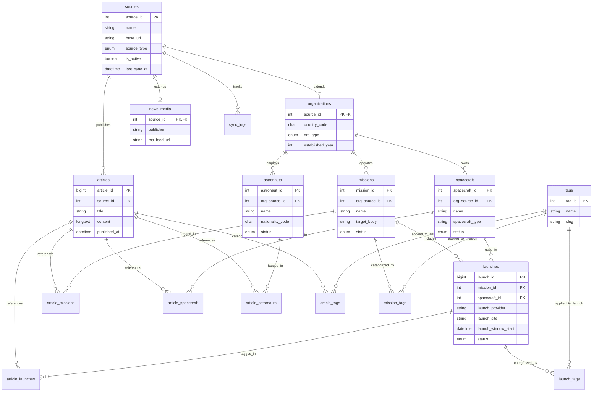

# Database Schema

## Overview

This database architecture is designed for a comprehensive space exploration information portal. It uses the Class Table Inheritance pattern to separate organizations (space agencies, commercial contractors, research institutes) and news media entities in the sources table.

In addition to articles, missions, and tags, it includes core entities for launches, spacecraft, astronauts, and organizations, with many-to-many junction tables linking them back to articles, missions, and tags for flexible querying and filtering across the entire web UI.

## Entities Summary

- sources: Base table for all data ingesters containing shared network and status metadata.
- organizations: Sub-type table extending sources with organization-specific attributes (e.g., country code, organization type, established year).
- news_media: Sub-type table extending sources with media-specific attributes (e.g., RSS feed, paywall classification).
- articles: Stores collected news, announcements, and research data with a FULLTEXT index (ngram parser) and raw JSON payloads.
- missions: Tracks specific space missions and connects to responsible organizations.
- launches: Tracks individual rocket/space launch events, launch sites, and schedules.
- spacecraft: Catalog of space vehicles, probes, rovers, and crew capsules.
- astronauts: Records spacefarer profiles, nationalities, and organizational affiliations.
- tags: Taxonomy for filtering entries across the portal.
- article_missions / article_launches / article_spacecraft / article_astronauts: Junction tables linking articles to their respective domain entities.
- mission_tags / launch_tags / spacecraft_tags / astronaut_tags: Junction tables enabling direct taxonomy filtering on domain entities.
- sync_logs: Execution logs for API crawlers to monitor system health and rate limits.

---

## Entity-Relationship Diagram (UML / Mermaid)




---

## DDL (MySQL 8.0 Compatible)

```sql
CREATE DATABASE IF NOT EXISTS space_exploration_db
  DEFAULT CHARACTER SET utf8mb4
  DEFAULT COLLATE utf8mb4_0900_ai_ci;

USE space_exploration_db;

-- 1. Base Data Sources Table
CREATE TABLE sources (
    source_id INT UNSIGNED AUTO_INCREMENT PRIMARY KEY,
    name VARCHAR(100) NOT NULL,
    base_url VARCHAR(255) NOT NULL,
    api_endpoint VARCHAR(255) DEFAULT NULL,
    source_type ENUM('organization', 'news_media', 'blog', 'other') NOT NULL,
    is_active BOOLEAN NOT NULL DEFAULT TRUE,
    last_sync_at DATETIME DEFAULT NULL COMMENT 'Timestamp of last successful API sync',
    created_at DATETIME NOT NULL DEFAULT CURRENT_TIMESTAMP,
    updated_at DATETIME NOT NULL DEFAULT CURRENT_TIMESTAMP ON UPDATE CURRENT_TIMESTAMP,
    INDEX idx_source_type (source_type)
) ENGINE=InnoDB DEFAULT CHARSET=utf8mb4 COLLATE=utf8mb4_0900_ai_ci;

-- 2. Organizations Sub-type Table (Renamed from space_agencies)
CREATE TABLE organizations (
    source_id INT UNSIGNED PRIMARY KEY,
    country_code CHAR(3) DEFAULT NULL COMMENT 'ISO-3166 3-letter country code (e.g., USA, JPN)',
    org_type ENUM('government_agency', 'commercial_company', 'research_institute', 'non_profit', 'international_body') NOT NULL DEFAULT 'government_agency',
    established_year INT DEFAULT NULL,
    CONSTRAINT fk_organizations_source FOREIGN KEY (source_id) REFERENCES sources (source_id) ON DELETE CASCADE
) ENGINE=InnoDB DEFAULT CHARSET=utf8mb4 COLLATE=utf8mb4_0900_ai_ci;

-- 3. News Media Sub-type Table
CREATE TABLE news_media (
    source_id INT UNSIGNED PRIMARY KEY,
    publisher VARCHAR(100) DEFAULT NULL,
    rss_feed_url VARCHAR(255) DEFAULT NULL,
    paywall_type ENUM('free', 'freemium', 'subscription') NOT NULL DEFAULT 'free',
    CONSTRAINT fk_media_source FOREIGN KEY (source_id) REFERENCES sources (source_id) ON DELETE CASCADE
) ENGINE=InnoDB DEFAULT CHARSET=utf8mb4 COLLATE=utf8mb4_0900_ai_ci;

-- 4. Spacecraft Master Table
CREATE TABLE spacecraft (
    spacecraft_id INT UNSIGNED AUTO_INCREMENT PRIMARY KEY,
    org_source_id INT UNSIGNED DEFAULT NULL COMMENT 'Operating/owning organization',
    name VARCHAR(100) NOT NULL,
    spacecraft_type ENUM('rover', 'orbiter', 'lander', 'crew_capsule', 'space_station', 'probe', 'other') NOT NULL,
    status ENUM('development', 'active', 'retired', 'destroyed', 'lost') NOT NULL DEFAULT 'active',
    created_at DATETIME NOT NULL DEFAULT CURRENT_TIMESTAMP,
    updated_at DATETIME NOT NULL DEFAULT CURRENT_TIMESTAMP ON UPDATE CURRENT_TIMESTAMP,
    CONSTRAINT fk_spacecraft_org FOREIGN KEY (org_source_id) REFERENCES organizations (source_id) ON DELETE SET NULL,
    UNIQUE KEY uq_spacecraft_name (name)
) ENGINE=InnoDB DEFAULT CHARSET=utf8mb4 COLLATE=utf8mb4_0900_ai_ci;

-- 5. Astronauts Master Table
CREATE TABLE astronauts (
    astronaut_id INT UNSIGNED AUTO_INCREMENT PRIMARY KEY,
    org_source_id INT UNSIGNED DEFAULT NULL COMMENT 'Affiliated organization',
    name VARCHAR(150) NOT NULL,
    nationality_code CHAR(3) DEFAULT NULL COMMENT 'ISO-3166 3-letter country code',
    status ENUM('active', 'retired', 'deceased') NOT NULL DEFAULT 'active',
    birth_date DATE DEFAULT NULL,
    created_at DATETIME NOT NULL DEFAULT CURRENT_TIMESTAMP,
    updated_at DATETIME NOT NULL DEFAULT CURRENT_TIMESTAMP ON UPDATE CURRENT_TIMESTAMP,
    CONSTRAINT fk_astronauts_org FOREIGN KEY (org_source_id) REFERENCES organizations (source_id) ON DELETE SET NULL
) ENGINE=InnoDB DEFAULT CHARSET=utf8mb4 COLLATE=utf8mb4_0900_ai_ci;

-- 6. Space Missions Table
CREATE TABLE missions (
    mission_id INT UNSIGNED AUTO_INCREMENT PRIMARY KEY,
    org_source_id INT UNSIGNED DEFAULT NULL COMMENT 'Optional link to responsible organization',
    name VARCHAR(100) NOT NULL,
    target_body VARCHAR(50) DEFAULT NULL COMMENT 'Target astronomical object (e.g., Mars, Moon)',
    status ENUM('planned', 'active', 'completed', 'failed') NOT NULL DEFAULT 'planned',
    launched_at DATETIME DEFAULT NULL,
    created_at DATETIME NOT NULL DEFAULT CURRENT_TIMESTAMP,
    updated_at DATETIME NOT NULL DEFAULT CURRENT_TIMESTAMP ON UPDATE CURRENT_TIMESTAMP,
    CONSTRAINT fk_missions_org FOREIGN KEY (org_source_id) REFERENCES organizations (source_id) ON DELETE SET NULL,
    UNIQUE KEY uq_mission_name (name)
) ENGINE=InnoDB DEFAULT CHARSET=utf8mb4 COLLATE=utf8mb4_0900_ai_ci;

-- 7. Launches Table
CREATE TABLE launches (
    launch_id BIGINT UNSIGNED AUTO_INCREMENT PRIMARY KEY,
    mission_id INT UNSIGNED DEFAULT NULL,
    spacecraft_id INT UNSIGNED DEFAULT NULL,
    launch_provider VARCHAR(100) DEFAULT NULL COMMENT 'e.g., SpaceX, Arianespace, ULA',
    rocket_name VARCHAR(100) NOT NULL COMMENT 'e.g., Falcon 9, H3, Vulcan Centaur',
    launch_site VARCHAR(255) DEFAULT NULL,
    launch_window_start DATETIME DEFAULT NULL,
    launch_window_end DATETIME DEFAULT NULL,
    status ENUM('scheduled', 'go_for_launch', 'success', 'failure', 'partial_failure', 'cancelled') NOT NULL DEFAULT 'scheduled',
    created_at DATETIME NOT NULL DEFAULT CURRENT_TIMESTAMP,
    updated_at DATETIME NOT NULL DEFAULT CURRENT_TIMESTAMP ON UPDATE CURRENT_TIMESTAMP,
    CONSTRAINT fk_launches_mission FOREIGN KEY (mission_id) REFERENCES missions (mission_id) ON DELETE SET NULL,
    CONSTRAINT fk_launches_spacecraft FOREIGN KEY (spacecraft_id) REFERENCES spacecraft (spacecraft_id) ON DELETE SET NULL,
    INDEX idx_launch_window (launch_window_start)
) ENGINE=InnoDB DEFAULT CHARSET=utf8mb4 COLLATE=utf8mb4_0900_ai_ci;

-- 8. Ingested Articles & Content Table
CREATE TABLE articles (
    article_id BIGINT UNSIGNED AUTO_INCREMENT PRIMARY KEY,
    source_id INT UNSIGNED NOT NULL,
    external_id VARCHAR(255) DEFAULT NULL COMMENT 'Unique identifier from external API',
    title VARCHAR(512) NOT NULL,
    author VARCHAR(255) DEFAULT NULL,
    content LONGTEXT NOT NULL,
    summary TEXT DEFAULT NULL,
    original_url VARCHAR(2048) NOT NULL,
    published_at DATETIME NOT NULL,
    raw_api_payload JSON DEFAULT NULL COMMENT 'Original JSON response from external API',
    created_at DATETIME NOT NULL DEFAULT CURRENT_TIMESTAMP,
    updated_at DATETIME NOT NULL DEFAULT CURRENT_TIMESTAMP ON UPDATE CURRENT_TIMESTAMP,
    CONSTRAINT fk_articles_source FOREIGN KEY (source_id) REFERENCES sources (source_id) ON DELETE CASCADE,
    UNIQUE KEY uq_source_external (source_id, external_id),
    INDEX idx_published_at (published_at),
    FULLTEXT KEY ft_title_content (title, content) WITH PARSER ngram
) ENGINE=InnoDB DEFAULT CHARSET=utf8mb4 COLLATE=utf8mb4_0900_ai_ci;

-- 9. Filtering Tags Table
CREATE TABLE tags (
    tag_id INT UNSIGNED AUTO_INCREMENT PRIMARY KEY,
    name VARCHAR(50) NOT NULL,
    slug VARCHAR(50) NOT NULL,
    created_at DATETIME NOT NULL DEFAULT CURRENT_TIMESTAMP,
    UNIQUE KEY uq_tag_name (name),
    UNIQUE KEY uq_tag_slug (slug)
) ENGINE=InnoDB DEFAULT CHARSET=utf8mb4 COLLATE=utf8mb4_0900_ai_ci;

-- 10. Article Junction Tables
CREATE TABLE article_missions (
    article_id BIGINT UNSIGNED NOT NULL,
    mission_id INT UNSIGNED NOT NULL,
    PRIMARY KEY (article_id, mission_id),
    CONSTRAINT fk_am_article FOREIGN KEY (article_id) REFERENCES articles (article_id) ON DELETE CASCADE,
    CONSTRAINT fk_am_mission FOREIGN KEY (mission_id) REFERENCES missions (mission_id) ON DELETE CASCADE
) ENGINE=InnoDB DEFAULT CHARSET=utf8mb4 COLLATE=utf8mb4_0900_ai_ci;

CREATE TABLE article_launches (
    article_id BIGINT UNSIGNED NOT NULL,
    launch_id BIGINT UNSIGNED NOT NULL,
    PRIMARY KEY (article_id, launch_id),
    CONSTRAINT fk_al_article FOREIGN KEY (article_id) REFERENCES articles (article_id) ON DELETE CASCADE,
    CONSTRAINT fk_al_launch FOREIGN KEY (launch_id) REFERENCES launches (launch_id) ON DELETE CASCADE
) ENGINE=InnoDB DEFAULT CHARSET=utf8mb4 COLLATE=utf8mb4_0900_ai_ci;

CREATE TABLE article_spacecraft (
    article_id BIGINT UNSIGNED NOT NULL,
    spacecraft_id INT UNSIGNED NOT NULL,
    PRIMARY KEY (article_id, spacecraft_id),
    CONSTRAINT fk_as_article FOREIGN KEY (article_id) REFERENCES articles (article_id) ON DELETE CASCADE,
    CONSTRAINT fk_as_spacecraft FOREIGN KEY (spacecraft_id) REFERENCES spacecraft (spacecraft_id) ON DELETE CASCADE
) ENGINE=InnoDB DEFAULT CHARSET=utf8mb4 COLLATE=utf8mb4_0900_ai_ci;

CREATE TABLE article_astronauts (
    article_id BIGINT UNSIGNED NOT NULL,
    astronaut_id INT UNSIGNED NOT NULL,
    PRIMARY KEY (article_id, astronaut_id),
    CONSTRAINT fk_aa_article FOREIGN KEY (article_id) REFERENCES articles (article_id) ON DELETE CASCADE,
    CONSTRAINT fk_aa_astronaut FOREIGN KEY (astronaut_id) REFERENCES astronauts (astronaut_id) ON DELETE CASCADE
) ENGINE=InnoDB DEFAULT CHARSET=utf8mb4 COLLATE=utf8mb4_0900_ai_ci;

CREATE TABLE article_tags (
    article_id BIGINT UNSIGNED NOT NULL,
    tag_id INT UNSIGNED NOT NULL,
    PRIMARY KEY (article_id, tag_id),
    CONSTRAINT fk_at_article FOREIGN KEY (article_id) REFERENCES articles (article_id) ON DELETE CASCADE,
    CONSTRAINT fk_at_tag FOREIGN KEY (tag_id) REFERENCES tags (tag_id) ON DELETE CASCADE
) ENGINE=InnoDB DEFAULT CHARSET=utf8mb4 COLLATE=utf8mb4_0900_ai_ci;

-- 11. Entity Taxonomy Tags Junction Tables
CREATE TABLE mission_tags (
    mission_id INT UNSIGNED NOT NULL,
    tag_id INT UNSIGNED NOT NULL,
    PRIMARY KEY (mission_id, tag_id),
    CONSTRAINT fk_mt_mission FOREIGN KEY (mission_id) REFERENCES missions (mission_id) ON DELETE CASCADE,
    CONSTRAINT fk_mt_tag FOREIGN KEY (tag_id) REFERENCES tags (tag_id) ON DELETE CASCADE
) ENGINE=InnoDB DEFAULT CHARSET=utf8mb4 COLLATE=utf8mb4_0900_ai_ci;

CREATE TABLE launch_tags (
    launch_id BIGINT UNSIGNED NOT NULL,
    tag_id INT UNSIGNED NOT NULL,
    PRIMARY KEY (launch_id, tag_id),
    CONSTRAINT fk_lt_launch FOREIGN KEY (launch_id) REFERENCES launches (launch_id) ON DELETE CASCADE,
    CONSTRAINT fk_lt_tag FOREIGN KEY (tag_id) REFERENCES tags (tag_id) ON DELETE CASCADE
) ENGINE=InnoDB DEFAULT CHARSET=utf8mb4 COLLATE=utf8mb4_0900_ai_ci;

-- 12. Crawler Sync Execution Logs
CREATE TABLE sync_logs (
    log_id BIGINT UNSIGNED AUTO_INCREMENT PRIMARY KEY,
    source_id INT UNSIGNED NOT NULL,
    status ENUM('success', 'partial_success', 'failed') NOT NULL,
    fetched_count INT UNSIGNED NOT NULL DEFAULT 0,
    error_message TEXT DEFAULT NULL,
    executed_at DATETIME NOT NULL DEFAULT CURRENT_TIMESTAMP,
    CONSTRAINT fk_sync_logs_source FOREIGN KEY (source_id) REFERENCES sources (source_id) ON DELETE CASCADE,
    INDEX idx_source_executed (source_id, executed_at)
) ENGINE=InnoDB DEFAULT CHARSET=utf8mb4 COLLATE=utf8mb4_0900_ai_ci;
```
