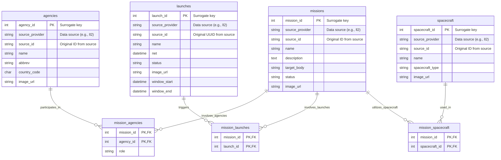

# Database Schema

## Overview

This database architecture is designed for a space exploration information portal. It uses the Class Table Inheritance pattern to separate organizations from the shared sources table, and stores space missions, taxonomy tags, and crawler synchronization history.

## Entities Summary

- sources: Base table for all data sources containing shared network and status metadata.
- organizations: Sub-type table extending sources with organization-specific attributes.
- missions: Tracks specific space missions and connects them to responsible organizations.
- tags: Taxonomy for filtering missions.
- mission_tags: Junction table connecting missions to tags.
- sync_logs: Execution logs for API crawlers to monitor system health and rate limits.

---

## Entity-Relationship Diagram (UML / Mermaid)



## DDL (MySQL 8.0 Compatible)

```sql
CREATE DATABASE IF NOT EXISTS space_exploration_db
  DEFAULT CHARACTER SET utf8mb4
  DEFAULT COLLATE utf8mb4_0900_ai_ci;

USE space_exploration_db;

-- 1. Agencies (宇宙機関・事業者)
CREATE TABLE agencies (
    agency_id INT UNSIGNED AUTO_INCREMENT PRIMARY KEY COMMENT 'Internal surrogate primary key',
    source_provider VARCHAR(32) NOT NULL DEFAULT 'll2' COMMENT 'Data source identifier (e.g., ll2, nasa)',
    source_id VARCHAR(100) NOT NULL COMMENT 'Original ID from the data source',
    name VARCHAR(150) NOT NULL,
    abbrev VARCHAR(50) DEFAULT NULL,
    country_code CHAR(3) DEFAULT NULL COMMENT 'ISO-3166 3-letter country code (e.g., USA, JPN)',
    image_url VARCHAR(255) DEFAULT NULL COMMENT 'Agency logo or related image URL for UI',
    created_at DATETIME NOT NULL DEFAULT CURRENT_TIMESTAMP,
    updated_at DATETIME NOT NULL DEFAULT CURRENT_TIMESTAMP ON UPDATE CURRENT_TIMESTAMP,
    UNIQUE KEY uq_agency_source (source_provider, source_id)
) ENGINE=InnoDB DEFAULT CHARSET=utf8mb4 COLLATE=utf8mb4_0900_ai_ci;

-- 2. Launches (打ち上げイベント)
CREATE TABLE launches (
    launch_id INT UNSIGNED AUTO_INCREMENT PRIMARY KEY COMMENT 'Internal surrogate primary key',
    source_provider VARCHAR(32) NOT NULL DEFAULT 'll2' COMMENT 'Data source identifier',
    source_id VARCHAR(100) NOT NULL COMMENT 'Original UUID or ID from the data source',
    name VARCHAR(200) NOT NULL,
    net DATETIME NOT NULL COMMENT 'No Earlier Than (Launch time)',
    status VARCHAR(50) NOT NULL DEFAULT 'TBD',
    image_url VARCHAR(255) DEFAULT NULL COMMENT 'Launch/Rocket featured image URL for UI',
    window_start DATETIME DEFAULT NULL,
    window_end DATETIME DEFAULT NULL,
    created_at DATETIME NOT NULL DEFAULT CURRENT_TIMESTAMP,
    updated_at DATETIME NOT NULL DEFAULT CURRENT_TIMESTAMP ON UPDATE CURRENT_TIMESTAMP,
    UNIQUE KEY uq_launch_source (source_provider, source_id),
    INDEX idx_launch_net (net)
) ENGINE=InnoDB DEFAULT CHARSET=utf8mb4 COLLATE=utf8mb4_0900_ai_ci;

-- 3. Spacecraft (宇宙機・衛星・探査機)
CREATE TABLE spacecraft (
    spacecraft_id INT UNSIGNED AUTO_INCREMENT PRIMARY KEY COMMENT 'Internal surrogate primary key',
    source_provider VARCHAR(32) NOT NULL DEFAULT 'll2' COMMENT 'Data source identifier',
    source_id VARCHAR(100) NOT NULL COMMENT 'Original ID from the data source',
    name VARCHAR(150) NOT NULL,
    spacecraft_type VARCHAR(100) DEFAULT NULL,
    image_url VARCHAR(255) DEFAULT NULL COMMENT 'Spacecraft image URL for UI',
    created_at DATETIME NOT NULL DEFAULT CURRENT_TIMESTAMP,
    updated_at DATETIME NOT NULL DEFAULT CURRENT_TIMESTAMP ON UPDATE CURRENT_TIMESTAMP,
    UNIQUE KEY uq_spacecraft_source (source_provider, source_id)
) ENGINE=InnoDB DEFAULT CHARSET=utf8mb4 COLLATE=utf8mb4_0900_ai_ci;

-- 4. Missions (ミッション主体の中核テーブル)
CREATE TABLE missions (
    mission_id INT UNSIGNED AUTO_INCREMENT PRIMARY KEY COMMENT 'Internal surrogate primary key',
    source_provider VARCHAR(32) NOT NULL DEFAULT 'll2' COMMENT 'Data source identifier',
    source_id VARCHAR(100) NOT NULL COMMENT 'Original ID from the data source',
    name VARCHAR(150) NOT NULL,
    description TEXT NOT NULL COMMENT 'Detailed mission description for UI',
    target_body VARCHAR(50) DEFAULT NULL COMMENT 'Target astronomical object (e.g., Mars, Moon)',
    status VARCHAR(50) NOT NULL DEFAULT 'planned',
    image_url VARCHAR(255) DEFAULT NULL COMMENT 'Mission main thumbnail/image URL for UI',
    created_at DATETIME NOT NULL DEFAULT CURRENT_TIMESTAMP,
    updated_at DATETIME NOT NULL DEFAULT CURRENT_TIMESTAMP ON UPDATE CURRENT_TIMESTAMP,
    UNIQUE KEY uq_mission_source (source_provider, source_id),
    INDEX idx_mission_target (target_body)
) ENGINE=InnoDB DEFAULT CHARSET=utf8mb4 COLLATE=utf8mb4_0900_ai_ci;

-- 5. Mission Agencies Junction Table (複数機関の合同ミッションに対応)
CREATE TABLE mission_agencies (
    mission_id INT UNSIGNED NOT NULL,
    agency_id INT UNSIGNED NOT NULL,
    role VARCHAR(50) DEFAULT 'Participant' COMMENT 'Role in mission, e.g., Primary, Contributor, Operator',
    PRIMARY KEY (mission_id, agency_id),
    CONSTRAINT fk_ma_mission FOREIGN KEY (mission_id) REFERENCES missions (mission_id) ON DELETE CASCADE,
    CONSTRAINT fk_ma_agency FOREIGN KEY (agency_id) REFERENCES agencies (agency_id) ON DELETE CASCADE
) ENGINE=InnoDB DEFAULT CHARSET=utf8mb4 COLLATE=utf8mb4_0900_ai_ci;

-- 6. Mission Launches Junction Table (多対多の打ち上げ紐づけ)
CREATE TABLE mission_launches (
    mission_id INT UNSIGNED NOT NULL,
    launch_id INT UNSIGNED NOT NULL,
    PRIMARY KEY (mission_id, launch_id),
    CONSTRAINT fk_ml_mission FOREIGN KEY (mission_id) REFERENCES missions (mission_id) ON DELETE CASCADE,
    CONSTRAINT fk_ml_launch FOREIGN KEY (launch_id) REFERENCES launches (launch_id) ON DELETE CASCADE
) ENGINE=InnoDB DEFAULT CHARSET=utf8mb4 COLLATE=utf8mb4_0900_ai_ci;

-- 7. Mission Spacecraft Junction Table (多対多の宇宙機紐づけ)
CREATE TABLE mission_spacecraft (
    mission_id INT UNSIGNED NOT NULL,
    spacecraft_id INT UNSIGNED NOT NULL,
    PRIMARY KEY (mission_id, spacecraft_id),
    CONSTRAINT fk_ms_mission FOREIGN KEY (mission_id) REFERENCES missions (mission_id) ON DELETE CASCADE,
    CONSTRAINT fk_ms_spacecraft FOREIGN KEY (spacecraft_id) REFERENCES spacecraft (spacecraft_id) ON DELETE CASCADE
) ENGINE=InnoDB DEFAULT CHARSET=utf8mb4 COLLATE=utf8mb4_0900_ai_ci;
```

## Future Considerations: Handling Unbound Entities (Launch / Spacecraft)

In our Phase 1 design, we adopted a **Mission-Centric** model where `launches` and `spacecraft` are tightly coupled to `missions`. However, if the business requirements or data sources reveal independent entities that exist without a direct parent mission (e.g., test flights, orbital tests of raw boosters, or unassigned spacecraft reserves), the database architecture must be refactored with the following key steps:

### 1. Re-introducing `agency_id` to Child Tables
* **Action**: Restore the `agency_id` foreign key column to both `launches` and `spacecraft` tables.
* **Rationale**: Independent launches (like commercial rideshares or test flights) and standalone spacecraft are directly operated or owned by an agency (`agencies`), bypassing the `missions` entity.

