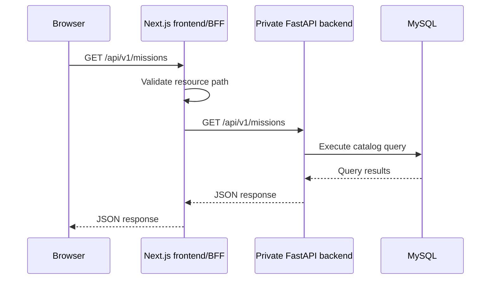
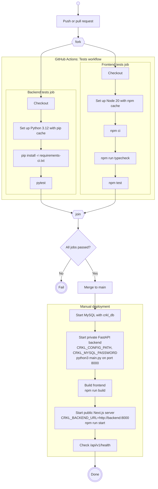

# Specifications

## Frontend request sequence

The browser communicates with the same-origin Next.js frontend. The Next.js
backend-for-frontend (BFF) forwards approved read-only API requests to the
private FastAPI backend. The backend queries MySQL and returns the response
through the same path.

The BFF entrypoint is `frontend/app/api/[...path]/route.ts`. Its private
backend address is configured with the server-only `CRKL_BACKEND_URL`
environment variable. The browser must not call the backend address directly.

## Deploy pipeline

GitHub Actions (`.github/workflows/tests.yml`) runs the backend and frontend
test jobs in parallel on every push and pull request. The workflow does not
build artifacts or deploy. Deployment is manual: the backend and frontend are
started by hand, and only the frontend is exposed publicly.

Mermaid has no native UML activity diagram, so this flowchart uses UML
activity notation: the empty circle marks the start, `fork`/`join` mark
parallel jobs, and the double circles mark end states. The test jobs use
mocked dependencies, so CI never connects to MySQL or a running server.
