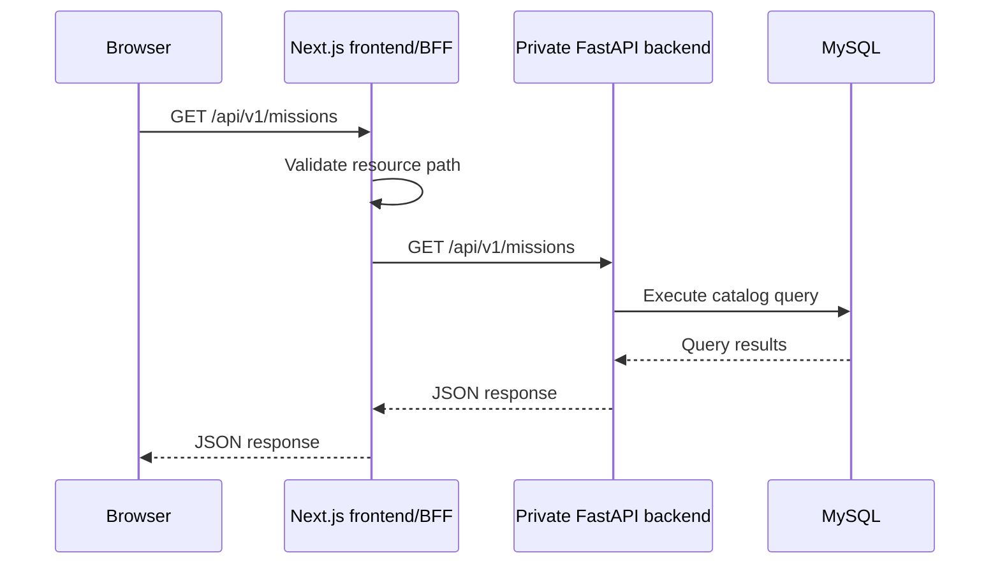

# Specifications

## Frontend request sequence

The browser communicates with the same-origin Next.js frontend. The Next.js
backend-for-frontend (BFF) forwards approved read-only API requests to the
private FastAPI backend. The backend queries MySQL and returns the response
through the same path.

The BFF entrypoint is `frontend/app/api/[...path]/route.ts`. Its private
backend address is configured with the server-only `CRKL_BACKEND_URL`
environment variable. The browser must not call the backend address directly.
