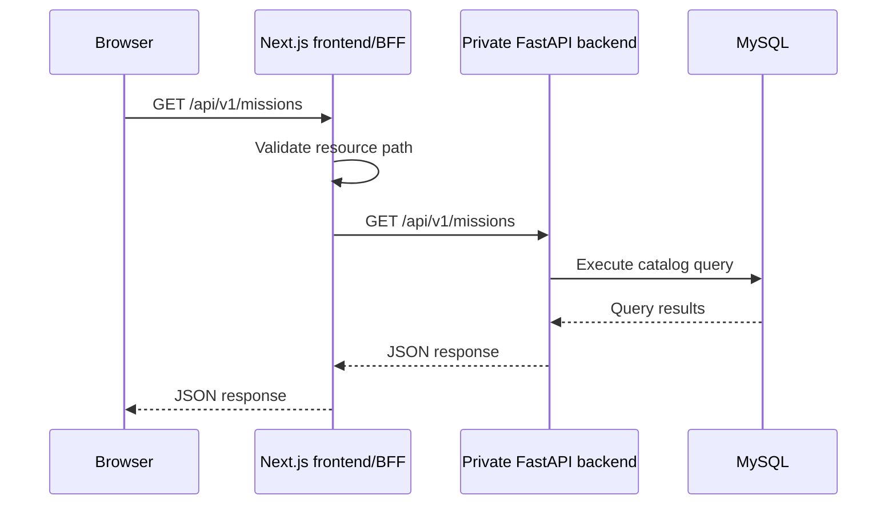
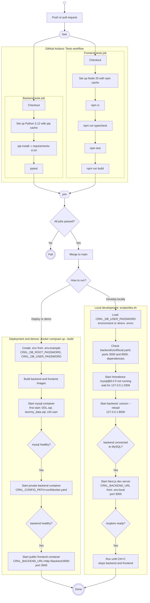

# Specifications

## Frontend request sequence

The browser communicates with the same-origin Next.js frontend. The Next.js
backend-for-frontend (BFF) forwards approved read-only API requests to the
private FastAPI backend. The backend queries MySQL and returns the response
through the same path.

The BFF entrypoint is `frontend/app/api/[...path]/route.ts`. Its private
backend address is configured with the server-only `CRKL_BACKEND_URL`
environment variable. The browser must not call the backend address directly.

## Deploy pipeline

GitHub Actions (`.github/workflows/tests.yml`) runs the backend and frontend
jobs in parallel on every push and pull request. The frontend job also runs a
production build. The workflow does not publish artifacts or deploy.

The app can be run in two ways:

- **Docker Compose** (`docker-compose.yml`), for deployment and demos: one
  command builds the images and starts MySQL, the private FastAPI backend,
  and the public Next.js frontend. Health checks start each service only
  after the one it depends on is ready. On first start, MySQL loads the
  schema, the sample data, and the least-privilege `crkl` user. Only the
  frontend port (3000) is published.
- **Local development** (`scripts/dev.sh`), without Docker: starts Homebrew
  MySQL if needed, the backend with auto-reload, and the Next.js dev server,
  and stops both servers on Ctrl+C.

Both serve the app on port 3000, so run one at a time.

Mermaid has no native UML activity diagram, so this flowchart uses UML
activity notation: the empty circle marks the start, `fork`/`join` mark
parallel jobs, diamonds mark decisions, and the double circles mark end
states. The test jobs use mocked dependencies, so CI never connects to MySQL
or a running server.
